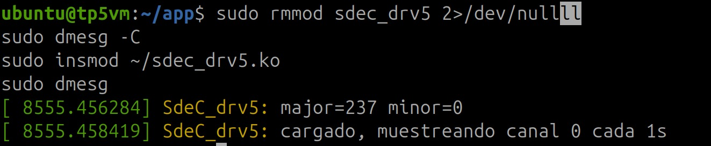
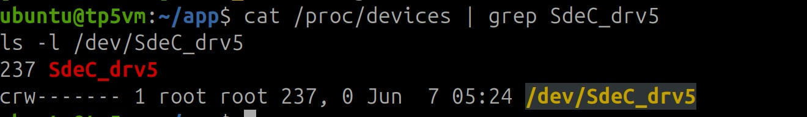
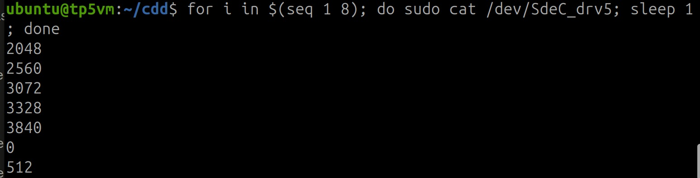
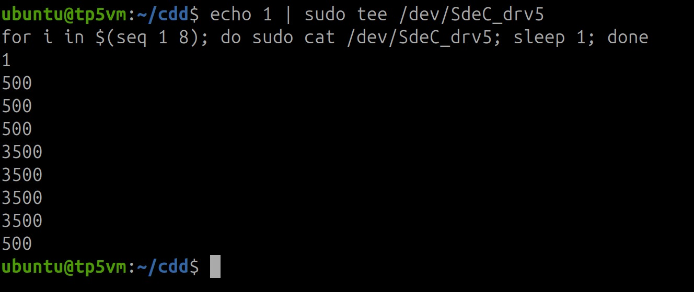
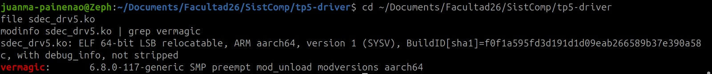
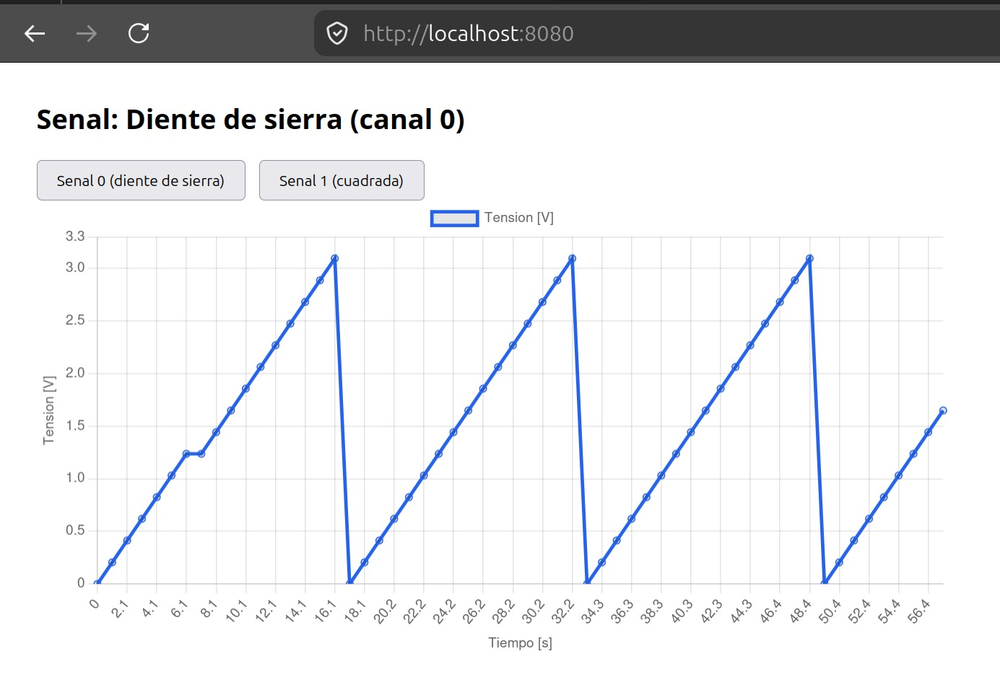
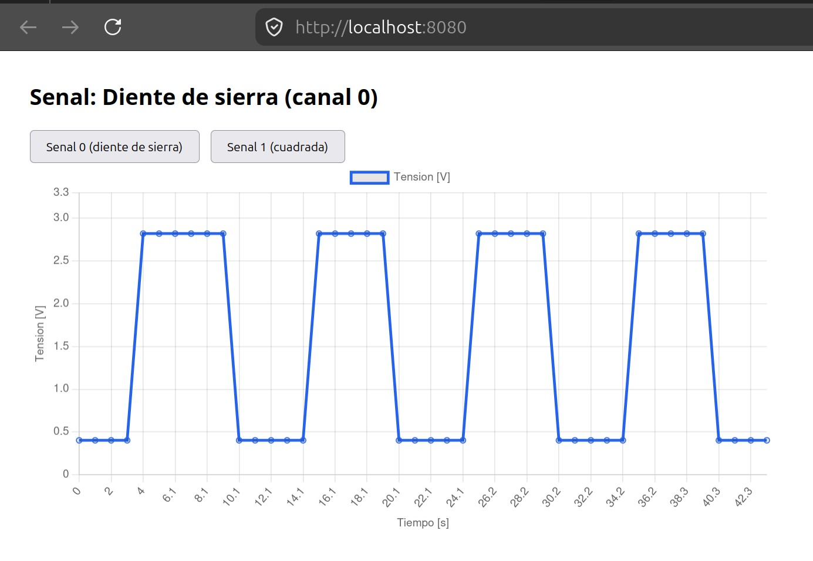

# Trabajo Práctico 5 — Linux Character Device Driver

Universidad Nacional de Córdoba — Facultad de Ciencias Exactas, Físicas y Naturales
Sistemas de Computación — Cátedra Mag. Ing. Miguel A. Solinas

Alumnos:
- Baccino, Luca
- Painenao, Juan Manuel
- Stangaferro, Alejandro

Fecha: 09-06-2026

---

## 1. Objetivo

El trabajo consiste en diseñar y construir un Character Device Driver (CDD) que sense dos señales externas con un período de un segundo. Una aplicación de nivel de usuario debe leer una de las dos señales y graficarla en función del tiempo, indicar a la aplicación cuál de las dos señales leer, y resetear el gráfico al cambiar de señal. 

---

## 2. Marco teórico

Un device driver es una pieza de software que permite al sistema operativo interactuar con un periférico, creando una abstracción del hardware y ofreciendo una interfaz para utilizarlo. En Linux los drivers se clasifican en tres verticales: orientados a paquetes (network), a bloques (storage) y a bytes (character). El grupo mayoritario es el de los character device driver, que abarca controladores de puertos serie, audio, video y E/S básica.

El modelo de capas de un CDD es: aplicación, archivo de dispositivo de caracteres (CDF) en /dev, character device driver (CDD) en el kernel, y el dispositivo de caracteres. El vínculo entre la aplicación y el CDF se basa en el nombre del archivo; el vínculo entre el CDF y el CDD se basa en el número de dispositivo, no en el nombre. Ese número es el par mayor-menor (major, minor): el mayor identifica al driver y el menor a la instancia del dispositivo.

Los pasos para conectar un CDF con un CDD son dos: registrar el rango (mayor, menor) del CDD, y vincular las operaciones del CDF a las funciones del CDD a través de la estructura file_operations. Desde el kernel 2.6 en adelante, la creación del archivo de dispositivo se delega al espacio de usuario: el kernel completa la clase y la información del dispositivo en sysfs, y el demonio udev crea automáticamente el nodo en /dev.

---

## 3. Entorno de desarrollo y decisiones de diseño

### 3.1. Cambio de hardware a entorno simulado

El trabajo se planeó originalmente sobre una Raspberry Pi 3. Al no tener una placa (En realidad se consiguió una, pero resulta que el diodo protector estaba quemado), se migró a un entorno completamente simulado con QEMU, alternativa contemplada por la cátedra.

La primera opción evaluada fue qemu-rpi-gpio, que emula el GPIO de la Raspberry e inyecta valores de pin desde el host por el protocolo qtest. Esta vía resultó inviable en la práctica: los scripts del proyecto son antiguos y no son compatibles con la imagen actual de Raspberry Pi OS ni con QEMU 8.2.2. El montaje de la imagen falló (dejando un rootfs vacío) y el lanzamiento de QEMU fue rechazado por una opción inválida. Reconstruir esa cadena a mano implicaba un riesgo alto sin garantía de booteo.

Se optó entonces por una máquina virtual genérica aarch64 con la máquina virt de QEMU y Ubuntu Server 24.04. Esta elección prioriza la fiabilidad: red y SSH sólidos por virtio, instalación de headers por apt y compilación sin conflictos de versión. El costo es que la máquina virt no posee el controlador de GPIO de la Raspberry.

### 3.2. Generación de las señales (sustitución del GPIO)

Como la máquina virt no expone GPIO, el driver genera internamente las dos señales que representan dos sensores. La lógica de muestreo periódico, selección de canal y entrega a userspace es idéntica a la que correría sobre hardware real leyendo dos pines por E/S mapeada en memoria; lo único sustituido es la fuente física de la señal. Esta decisión queda documentada de forma explícita por transparencia.

Las dos señales, expresadas como valor crudo de un sensor de 12 bits (rango 0 a 4095):

| Canal | Señal | Comportamiento |
|---|---|---|
| 0 | Diente de sierra | Sube de a 256 por segundo y reinicia cada 16 segundos |
| 1 | Onda cuadrada | 5 segundos en 500 y 5 segundos en 3500 (período 10 segundos) |

### 3.3. Topología del entorno

```
   HOST x86_64 (Ubuntu 24.04)                 VM aarch64 (Ubuntu 24.04, QEMU virt)
 +----------------------------+   scp .ko    +-------------------------------+
 |  Cross-compilacion del .ko |  --------->  |  insmod sdec_drv5.ko          |
 |  (aarch64-linux-gnu-)      |   puerto     |  /dev/SdeC_drv5 (CDD)         |
 |                            |   5555->22   |  app.py (Flask) lee cada 1 s  |
 |  Navegador web             |  <-------->  |  servidor web en puerto 8080  |
 +----------------------------+  8080->8080  +-------------------------------+
```

Figura 1: diagrama del entorno simulado.


---

## 4. Diseño e implementación del CDD

El driver se estructura en tres bloques de registro durante la carga del módulo:

1. Reserva dinámica del par (mayor, menor) con alloc_chrdev_region para un dispositivo.
2. Registro del cdev con sus file_operations mediante cdev_init y cdev_add.
3. Creación de la clase y el device con class_create y device_create, lo que dispara la creación automática del nodo /dev/SdeC_drv5 por udev.

Detalle surgido durante el desarrollo: en el kernel 6.8 la función class_create toma un único argumento (el nombre de la clase). Las diapositivas de la cátedra muestran la firma antigua con THIS_MODULE como primer argumento, que ya no compila en kernels recientes.

El muestreo periódico se implementa con un kernel timer (timer_list) que se re-arma cada segundo con mod_timer y un plazo de HZ jiffies (HZ jiffies equivalen a un segundo). En cada disparo, el timer avanza un contador, calcula el valor de la señal del canal activo y lo guarda en una variable de estado.

La operación read entrega el último valor muestreado como texto y devuelve EOF en la segunda lectura de una misma apertura, de modo que comandos como cat terminen correctamente. La operación write acepta el caracter 0 o 1 para seleccionar el canal y reinicia la fase de la señal para que el gráfico arranque limpio.

La concurrencia entre el timer (contexto softirq) y las operaciones read y write (contexto de proceso) se resuelve con un spinlock, usando spin_lock_bh en el contexto de proceso y spin_lock en el timer, que es el patrón correcto para compartir estado entre ambos contextos.

### 4.1. Código del driver: sdec_drv5.c

```c
#include <linux/module.h>
#include <linux/init.h>
#include <linux/fs.h>
#include <linux/cdev.h>
#include <linux/device.h>
#include <linux/uaccess.h>
#include <linux/timer.h>
#include <linux/jiffies.h>
#include <linux/spinlock.h>

#define DEVICE_NAME "SdeC_drv5"
#define CLASS_NAME  "SdeC_class"
#define ADC_MAX     4095          /* sensor simulado de 12 bits */

MODULE_LICENSE("GPL");
MODULE_AUTHOR("Juan");
MODULE_DESCRIPTION("CDD TP5 - 2 senales, timer 1s, seleccion de canal");

static dev_t dev_num;
static struct cdev my_cdev;
static struct class *my_class;

static struct timer_list sample_timer;
static spinlock_t lock;

static int channel;               /* 0 o 1: senal seleccionada */
static int latest;                /* ultimo valor muestreado */
static unsigned long tick;        /* segundos transcurridos */

/* Valor crudo de cada senal en el segundo t */
static int signal_value(int ch, unsigned long t)
{
    if (ch == 0)
        return (int)((t % 16) * 256);          /* diente de sierra */
    else
        return ((t % 10) < 5) ? 500 : 3500;    /* onda cuadrada */
}

/* Se ejecuta cada 1 s: muestrea el canal activo y se re-arma */
static void sample_cb(struct timer_list *t)
{
    spin_lock(&lock);
    tick++;
    latest = signal_value(channel, tick);
    spin_unlock(&lock);

    mod_timer(&sample_timer, jiffies + HZ);    /* HZ jiffies = 1 segundo */
}

static int my_open(struct inode *inode, struct file *file) { return 0; }
static int my_release(struct inode *inode, struct file *file) { return 0; }

static ssize_t my_read(struct file *file, char __user *buf, size_t len, loff_t *off)
{
    char tmp[16];
    int val, n;

    if (*off > 0)                 /* ya entregamos el valor en esta apertura */
        return 0;                 /* -> EOF, para que cat termine */

    spin_lock_bh(&lock);
    val = latest;
    spin_unlock_bh(&lock);

    n = scnprintf(tmp, sizeof(tmp), "%d\n", val);
    if (len < (size_t)n)
        return -EINVAL;
    if (copy_to_user(buf, tmp, n))
        return -EFAULT;

    *off += n;
    return n;
}

static ssize_t my_write(struct file *file, const char __user *buf, size_t len, loff_t *off)
{
    char c;

    if (len < 1)
        return -EINVAL;
    if (copy_from_user(&c, buf, 1))
        return -EFAULT;
    if (c != '0' && c != '1') {
        pr_warn("SdeC_drv5: canal invalido (use 0 o 1)\n");
        return -EINVAL;
    }

    spin_lock_bh(&lock);
    channel = c - '0';
    tick = 0;                     /* reiniciamos la fase de la nueva senal */
    latest = signal_value(channel, tick);
    spin_unlock_bh(&lock);

    pr_info("SdeC_drv5: canal seleccionado = %d\n", channel);
    return len;
}

static const struct file_operations fops = {
    .owner   = THIS_MODULE,
    .open    = my_open,
    .release = my_release,
    .read    = my_read,
    .write   = my_write,
};

static int __init drv_init(void)
{
    int ret;

    spin_lock_init(&lock);

    ret = alloc_chrdev_region(&dev_num, 0, 1, DEVICE_NAME);
    if (ret < 0)
        return ret;
    pr_info("SdeC_drv5: major=%d minor=%d\n", MAJOR(dev_num), MINOR(dev_num));

    cdev_init(&my_cdev, &fops);
    my_cdev.owner = THIS_MODULE;
    ret = cdev_add(&my_cdev, dev_num, 1);
    if (ret < 0) {
        unregister_chrdev_region(dev_num, 1);
        return ret;
    }

    my_class = class_create(CLASS_NAME);
    if (IS_ERR(my_class)) {
        cdev_del(&my_cdev);
        unregister_chrdev_region(dev_num, 1);
        return PTR_ERR(my_class);
    }
    device_create(my_class, NULL, dev_num, NULL, DEVICE_NAME);

    timer_setup(&sample_timer, sample_cb, 0);
    mod_timer(&sample_timer, jiffies + HZ);

    pr_info("SdeC_drv5: cargado, muestreando canal %d cada 1s\n", channel);
    return 0;
}

static void __exit drv_exit(void)
{
    del_timer_sync(&sample_timer);
    device_destroy(my_class, dev_num);
    class_destroy(my_class);
    cdev_del(&my_cdev);
    unregister_chrdev_region(dev_num, 1);
    pr_info("SdeC_drv5: descargado\n");
}

module_init(drv_init);
module_exit(drv_exit);
```

### 4.2. Makefile de compilación nativa (verificación dentro de la VM)

```make
obj-m := sdec_drv5.o
KDIR := /lib/modules/$(shell uname -r)/build
PWD := $(shell pwd)
all:
	$(MAKE) -C $(KDIR) M=$(PWD) modules
clean:
	$(MAKE) -C $(KDIR) M=$(PWD) clean
```

---

## 5. Aplicación de usuario y visualización

La aplicación corre dentro de la VM en Python con Flask. Un hilo en segundo plano abre el dispositivo cada segundo, lee el valor crudo del canal activo y lo convierte a tensión. La conversión de escala (valor crudo a Volts) se realiza en userspace, como pide la consigna, con la relación tension = crudo * 3.3 / 4095.

La aplicación expone tres rutas: la raíz sirve la página con el gráfico (Chart.js), la ruta de datos devuelve las muestras y el nombre de la señal en JSON, y la ruta de selección escribe el canal en el dispositivo y limpia el buffer de muestras. El frontend consulta los datos cada segundo y redibuja; como la selección de canal limpia el buffer del servidor, el gráfico se resetea automáticamente al cambiar de señal.

El gráfico rotula los ejes con Tiempo en el eje de abscisas y Tensión en el eje de ordenadas. Observación: la consigna indica unidades en abscisas y tiempo en ordenadas, que es la disposición inversa a la convención habitual. Se adoptó la convención estándar (tiempo en abscisas). Conviene confirmar este punto con la cátedra; invertir los ejes es un cambio de una línea en la configuración del gráfico.

La visualización se observa desde el navegador del host gracias al reenvío de puertos de QEMU (puerto 8080 del host al puerto 8080 de la VM), accediendo a la dirección local del host.

### 5.1. Código de la aplicación: app.py

```python
from flask import Flask, jsonify, request
import threading, time

DEV = "/dev/SdeC_drv5"
VREF = 3.3
ADC_MAX = 4095
NAMES = {0: "Diente de sierra", 1: "Onda cuadrada"}

app = Flask(__name__)
lock = threading.Lock()
samples = []
channel = 0
t0 = time.time()

def raw_to_volts(raw):
    return raw * VREF / ADC_MAX        # correccion de escala en userspace

def reader():
    while True:
        try:
            with open(DEV, "r") as f:
                raw = int(f.read().strip())
            v = raw_to_volts(raw)
            with lock:
                t = time.time() - t0
                samples.append((round(t, 1), round(v, 3)))
                if len(samples) > 60:
                    samples.pop(0)
        except Exception as e:
            print("read error:", e)
        time.sleep(1)

@app.route("/data")
def data():
    with lock:
        ts = [s[0] for s in samples]
        vs = [s[1] for s in samples]
        ch = channel
    return jsonify(channel=ch, name=NAMES[ch], unit="V", t=ts, v=vs)

@app.route("/select")
def select():
    global channel, samples, t0
    ch = request.args.get("ch", "0")
    if ch not in ("0", "1"):
        return "bad channel", 400
    with open(DEV, "w") as f:
        f.write(ch)
    with lock:
        channel = int(ch)
        samples = []           # reset del grafico al cambiar de senal
        t0 = time.time()
    return "ok"

@app.route("/")
def index():
    return HTML

HTML = """
<!doctype html><html lang="es"><head><meta charset="utf-8">
<title>TP5 - Senal vs tiempo</title>
<script src="https://cdn.jsdelivr.net/npm/chart.js"></script>
</head><body>
<h2 id="titulo">Senal</h2>
<button onclick="sel(0)">Senal 0 (diente de sierra)</button>
<button onclick="sel(1)">Senal 1 (cuadrada)</button>
<canvas id="chart"></canvas>
<script>
const chart = new Chart(document.getElementById('chart'), {
  type:'line',
  data:{labels:[],datasets:[{label:'Tension',data:[],borderColor:'#2563eb',tension:0}]},
  options:{animation:false,scales:{
    x:{title:{display:true,text:'Tiempo [s]'}},
    y:{title:{display:true,text:'Tension [V]'},min:0,max:3.3}}}
});
async function refresh(){
  const d = await (await fetch('/data')).json();
  document.getElementById('titulo').textContent = 'Senal: '+d.name+'  (canal '+d.channel+')';
  chart.data.labels = d.t;
  chart.data.datasets[0].label = 'Tension ['+d.unit+']';
  chart.data.datasets[0].data = d.v;
  chart.update();
}
async function sel(ch){ await fetch('/select?ch='+ch); await refresh(); }
setInterval(refresh, 1000); refresh();
</script></body></html>
"""

if __name__ == "__main__":
    threading.Thread(target=reader, daemon=True).start()
    app.run(host="0.0.0.0", port=8080)
```

---

## 6. Compilación cruzada

El módulo se compila en el host x86_64 apuntando a la arquitectura aarch64. Para garantizar que el binario cargue en la VM, el vermagic del módulo debe coincidir exactamente con la versión de kernel de la VM (6.8.0-117-generic). Por eso los headers usados para compilar se copiaron desde la propia VM, donde fueron instalados por apt para esa versión exacta.

Pasos del flujo de cross-compilation:

1. Instalación del toolchain en el host: gcc-aarch64-linux-gnu.
2. Empaquetado de los headers de la VM y copia al host por scp, recreándolos en /usr/src.
3. Compilación con un Makefile que define ARCH y CROSS_COMPILE.
4. Transferencia del binario a la VM por scp y carga con insmod.

Detalle importante surgido durante la simulación: al cross-compilar contra los headers de Ubuntu, el sistema de build ejecuta herramientas internas (como fixdep) que el paquete de headers trae precompiladas para ARM. En un host x86 esas herramientas no se ejecutan de forma nativa. La solución adoptada fue usar qemu-user-static junto con la variable QEMU_LD_PREFIX apuntando al sysroot ARM del cross-compiler (/usr/aarch64-linux-gnu), de modo que el loader dinámico aarch64 quede disponible. Una alternativa equivalente es eliminar las herramientas precompiladas para ARM dentro del árbol de headers y dejar que el build las regenere para x86.

Otro detalle a documentar: con Secure Boot deshabilitado, el módulo no firmado genera flags de taint en el kernel al cargarse (mensajes de signature missing). Esto es esperable y no impide la carga del módulo.

### 6.1. Makefile de compilación cruzada (host)

```make
obj-m := sdec_drv5.o
KDIR := /usr/src/linux-headers-6.8.0-117-generic
PWD := $(shell pwd)
ARCH := arm64
CROSS_COMPILE := aarch64-linux-gnu-
all:
	$(MAKE) -C $(KDIR) M=$(PWD) ARCH=$(ARCH) CROSS_COMPILE=$(CROSS_COMPILE) modules
clean:
	$(MAKE) -C $(KDIR) M=$(PWD) ARCH=$(ARCH) CROSS_COMPILE=$(CROSS_COMPILE) clean
```

### 6.2. Comandos clave del flujo

```bash
# host: toolchain
sudo apt install -y gcc-aarch64-linux-gnu qemu-user-static

# host: traer headers exactos desde la VM
scp -P 5555 ubuntu@localhost:~/headers.tgz .
sudo tar xzf headers.tgz -C /usr/src

# host: compilar para ARM
export QEMU_LD_PREFIX=/usr/aarch64-linux-gnu
make
file sdec_drv5.ko        # -> ELF 64-bit LSB relocatable, ARM aarch64

# host -> VM: transferir y cargar
scp -P 5555 sdec_drv5.ko ubuntu@localhost:~/
# (en la VM)
sudo insmod ~/sdec_drv5.ko
sudo chmod 666 /dev/SdeC_drv5
```

---

## 7. Pruebas y resultados

Verificación del registro del dispositivo tras la carga del módulo:

```bash
ls -l /dev/SdeC_drv5
# crw-rw-rw- 1 root root 237, 0 ... /dev/SdeC_drv5
cat /proc/devices | grep SdeC_drv5
# 237 SdeC_drv5
```



Figura 2: salida de dmesg al cargar el módulo (mayor asignado y mensaje de carga).



Figura 3: el major asignado dinámicamente aparece en /proc/devices.

Lecturas del canal 0 (diente de sierra), una por segundo, con valores crudos en aumento que reinician al completar el período:



Figura 4: valores crudos del diente de sierra leídos desde el dispositivo.

Lecturas del canal 1 (onda cuadrada) tras seleccionar el canal con write, alternando entre los dos niveles:



Figura 5: valores crudos de la onda cuadrada.

Verificación de que el binario es ARM aarch64 (resultado de la compilación cruzada):



Figura 6: file confirma que el .ko es ARM aarch64.

Visualización web de cada señal, con ejes rotulados y nombre de la señal:



Figura 7: gráfico del diente de sierra en el navegador del host.



Figura 8: gráfico de la onda cuadrada tras cambiar de canal (el gráfico se reseteó).

---

## 8. Conclusiones

Se construyó un Character Device Driver completo que muestrea dos señales cada un segundo mediante un kernel timer, permite seleccionar el canal a leer desde el espacio de usuario y entrega los valores crudos a la aplicación. La aplicación de usuario realiza la corrección de escala, grafica la señal en función del tiempo con sus unidades y resetea el gráfico al cambiar de canal. Todo el código del módulo se compiló de forma cruzada en el host x86 para la arquitectura aarch64 y se cargó en el destino transferido por SSH, cumpliendo el flujo de trabajo exigido.

La simulación obligó a tomar decisiones y resolver problemas que enriquecieron el trabajo: la migración a una máquina virt aarch64 ante la inviabilidad de qemu-rpi-gpio con las versiones actuales, la sustitución de la fuente física de las señales por generación interna en el driver, el ajuste de la firma de class_create al kernel 6.8, la coincidencia de vermagic entre host y destino, y la resolución del problema de las herramientas host precompiladas para ARM mediante QEMU_LD_PREFIX.

Limitaciones: al no disponer de GPIO en la máquina virt, las señales son generadas internamente y no provienen de pines físicos. La estructura del driver es la misma que se usaría sobre hardware real; el reemplazo se acota a la fuente de la señal, que sobre una Raspberry se obtendría leyendo registros de GPIO mapeados en memoria.

---

## 9. Referencias

- Cátedra Sistemas de Computación (FCEFyN, UNC). Linux Kernel Module Programming II.
- Cátedra Sistemas de Computación (FCEFyN, UNC). Kernel Device Tree (basado en T. Petazzoni, Device Tree: Hardware description for everybody).
- The Linux Kernel Module Programming Guide.
- Linux Kernel Labs. Device drivers.
- Documentación de QEMU y de las imágenes cloud de Ubuntu para arm64.